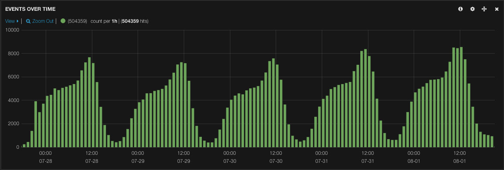
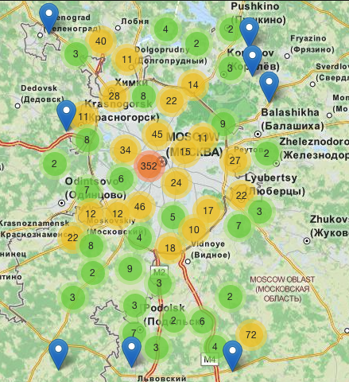
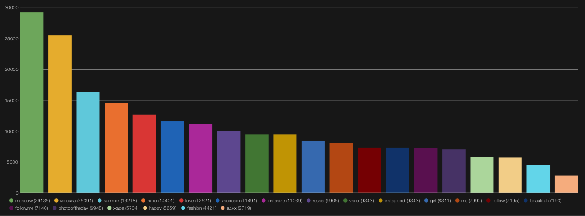

Pirozhki
========
[](https://travis-ci.org/ZubKonst/pirozhki)
[](https://gemnasium.com/ZubKonst/pirozhki)
[](https://codeclimate.com/github/ZubKonst/pirozhki)
[](https://coveralls.io/r/ZubKonst/pirozhki)

Pirozhki is a [sidekiq](http://sidekiq.org)-based utility for collecting data from social networks. 

##Available types of Pirozhki:
- Pirozhki with instagram and geotags. (GeoPoint table.)

##Run Pirozhki on the server:
- Fill with your data configs from `APP/config/variables/...` and put configs into server `{deploy_dir}/shared/variables`  
- Fill with your data `deploy_sample.yml`, rename to `deploy.yml` and use capistrano. `/config/variables/deploy.yml` is gitignored.
- Capistrano tips:
```
cap deploy:start (restart|stop)
cap web:start (restart|stop)
cap workers:start (restart|stop)
```

##Run Pirozhki locally:
- Fill with your data configs from `APP/config/variables/...`
- Enjoy [foreman](https://github.com/ddollar/foreman).
- Or use [docker](http://docker.com) [Step-by-step guide](info/docker_notes.md)

##Init database on the server from project path:
```
[APP_ENV=production] rake db:create
[APP_ENV=production] rake db:migrate
[APP_ENV=production] rake db:seed
```

##Run console:
```
[APP_ENV=production] irb -r ./app.rb
```

##Useful examples:
- Connecting with ELK (Elasticsearch, Logstash and Kibana) stack.
  - Posts over time 
  - Posts on the map 
  - Hashtags by popularity 

##License:
Pirozhki is a utility for collecting data from social networks.  
Copyright (C) 2014  Konstantin Zub (hello at zubkonst.com)

This program is free software: you can redistribute it and/or modify
it under the terms of the GNU General Public License as published by
the Free Software Foundation, either version 3 of the License, or
(at your option) any later version.

This program is distributed in the hope that it will be useful,
but WITHOUT ANY WARRANTY; without even the implied warranty of
MERCHANTABILITY or FITNESS FOR A PARTICULAR PURPOSE.  See the
GNU General Public License for more details.

You should have received a copy of the GNU General Public License
along with this program.  If not, see <http://www.gnu.org/licenses/>.
